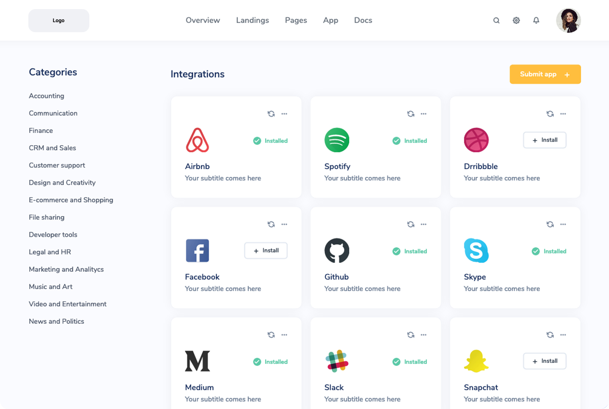

# Birchal Tech Test

## Description

This project was a requirement for the job application process for a Frontend Software Engineer position at Birchal. The aim of the task was a build a frontend from a design that was given to me using any technologies I wanted.

View the site [here](http://jyeharry.github.io/birchal-test).

This is the design I was given:



## Dependencies

I chose to build this project with [React](https://reactjs.org/) for its reusability. For example, I had to include nine card components on the page which would've been a hassle if I had to write out each tag that makes up the card nine times. Instead, I was to make an 'AppCard' components and get any custom values from props.

I also chose to use [Semantic UI React](https://react.semantic-ui.com/) components to save time. Like Bootstrap, they come with their own styles and can easily take on different looks. Included in the library are also grids and containers for dividing up the page.

## Installation

To download and use the site yourself, clone this repo then in the project directory type this line at the terminal:

```
$ npm install
```

Then to start the program:

```
$ npm start
```

## Acknowledgements

Thank you to Birchal for considering to have me on their team!
